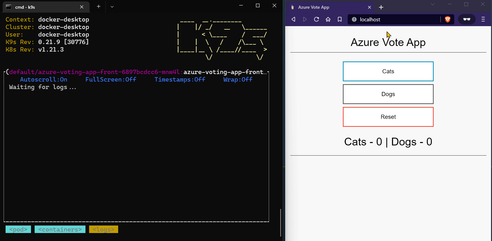

# Azure Voting App (.NET)

This sample is the .NET implementation of the [official Azure Voting App](https://github.com/Azure-Samples/azure-voting-app-redis). This sample creates a multi-container application in a Kubernetes cluster like the original one.

The application interface is built using ASP.NET Core Blazor Server. The data component uses Redis.

This sample also includes the following features:

1. Instrumented to produce OpenTelemetry traces and export the traces to the console.
2. Request to GET `/traced-exception` endpoint will throw an exception. It shows how unhandled exceptions are logged in the active OpenTelemtry span.
3. Instrumented to emit built-in .NET metrics and custom metrics with the [OpenTelemetry Metrics SDK](https://github.com/open-telemetry/opentelemetry-dotnet).
4. Deployment with Helm, Kubernetes manifest, or Docker compose.

## Note

1. The previous version of this application used [prometheus-net](https://github.com/prometheus-net/prometheus-net) to expose metrics to Prometheus on the `/metrics` endpoint. The main branch uses OTEL Metrics SDK to send metrics to the destination. You can use the commit tagged [prometheus-metrics](https://github.com/rahulrai-in/azure-voting-app-dotnet/tree/prometheus-metrics) to refer to the previous version of the application.
2. The application sends traces and metrics to the console exporter by default. You can set the environment variable `EnableOtlpExporter` to `true` to send traces and metrics to the local OTEL collector. Update the values of the connection strings `OTLPMetricsExporterEndpoint` and `OTLPTracesExporterEndpoint` if you want to send the metrics and traces to a remote OTLP endpoint. You can launch the application and the local OTEL collector with the following command:

```bash
docker-compose --profile local-collector up
```

## Demo


